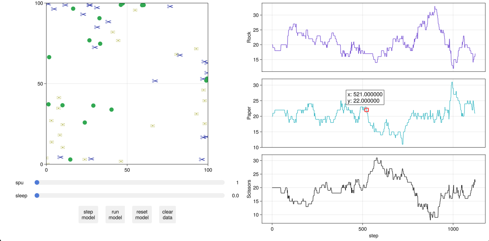

# Rock Paper Scissors in Julia

A simple simulation using `Agents.jl`.

Run it in VSCode with the Julia extension.

### Parameters

- Fleeing
- Chasing
- Separation
- Coherence
- Velocity matching
- Agility
- Variable speed

### Todo

- Step parallelisation
- Modifying model parameters on the fly
- Refactoring